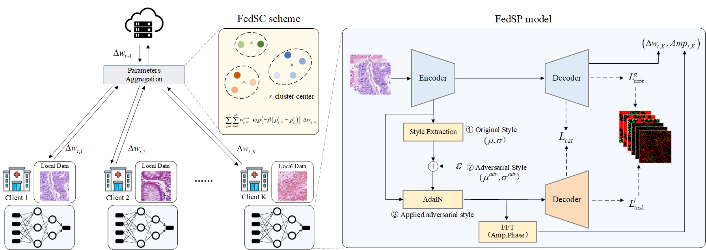

# Federated Learning for Weakly Supervised Nuclei Segmentation via Style Perturbation and Clustering
This is the PyTorch implemention of our paper **[Federated Learning for Weakly Supervised Nuclei Segmentation via Style Perturbation and Clustering](https://www.sciopen.com/article/10.26599/TST.2025.9010177)** by Qian, Yi and Pan, Xipeng and Wen, Yimin and Bian, Xinjun and Qin, Chuanbo

## Abstract

> Nuclei segmentation is crucial for cancer diagnosis but faces high annotation costs due to dense nuclei distribution. Weakly supervised learning with point annotations alleviates this burden, yet single-center data is limited, and centralized datasets are hindered by privacy concerns. Federated learning enables multi-institution collaboration while preserving privacy, but non-IID data distribution—particularly style heterogeneity from staining and equipment variations—complicates model aggregation. In this paper, we propose Federated learning with Style Perturbation and Clustering (FedSPC), a novel framework that integrates a Federated Style Perturbation (FedSP) model and a Federated Style Clustering (FedSC) strategy. During training, FedSP applies style adversarial perturbation to extract and adapt local style features, reducing local style bias. Meanwhile, FedSC groups clients by style similarity and adjusts aggregation weights based on intra-group performance, mitigating fairness propagation bias. FedSPC overcomes pathological image style heterogeneity through the combined use of FedSP and FedSC, delivering a practical federated learning solution for medical imaging. Evaluated against existing federated weakly supervised frameworks, conventional methods, and aggregation schemes, our approach significantly outperforms alternatives in nuclei segmentation tasks. Experiments confirm FedSPC’s superiority in handling style diversity and improving segmentation accuracy under federated settings.




### Train
```bash
python train.py
```

### Test

```bash
python test.py
```

## Citation
If you find the code and dataset useful, please cite our paper.
```latex
@article{qian2025federated,
  title={Federated Learning for Weakly Supervised Nuclei Segmentation via Style Perturbation and Clustering},
  author={Qian, Yi and Pan, Xipeng and Wen, Yimin and Bian, Xinjun and Qin, Chuanbo},
  journal={Tsinghua Science and Technology},
  year={2025},
  publisher={清华大学出版社}
}
```
